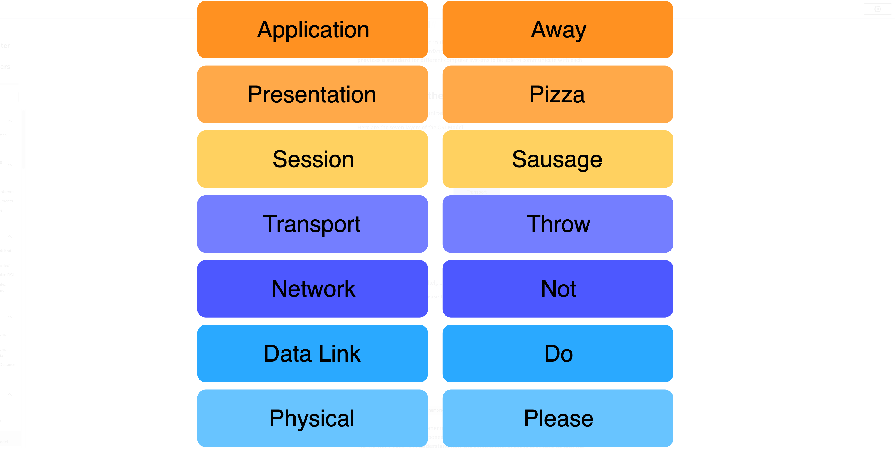
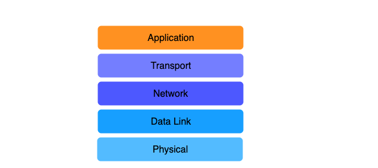
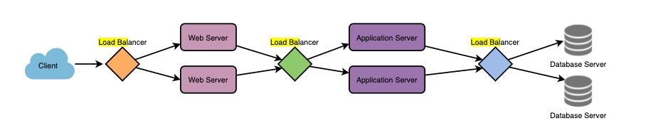

# Networking
A network is officially defined as a group or system of interconnected people or items.

The Internet is essentially a network of computer networks.

- IP (Internet Protocol) Address
    - The Internet Protocol (IP) is the network layer protocol of the TCP/IP protocol suite. The flexibility of IP and its ability to use various types of underlying data link layer technologies is one of its key advantages
    - IPv4 addresses are written as 32 bit numbers in dotted-decimal format, such as a sequence of four integers separated by dots. Dotted decimal is a format imposed upon the 32-bit numbers for relatively easier human readability. For example:
    - 1.2.3.4 corresponds to 00000001000000100000001100000100

    - Unique identifer for a computer connected to the internet
    - a dotted quad ex... 123.222.32.4
    - Each section can hava a value from 0 - 255
    - Each quad is 1 byte
    - highest possible ip address value would be 11111111.11111111.11111111.11111111
        - For convience most IPs are written in decimal 255.255.255.255
- The Problem with IP v4 
    - In this system only about 4.2 billion unique identifiers exist
        - In the early 1980s when the system was created this was not problem
        - Now There are more computers then that could connect to the internet
        - IP v6 was invented to increase this number
- Subnets
    -  routers should only maintain routes towards blocks of addresses and not towards individual hosts. For this, blocks of IP addresses are assigned to ISPs. The ISPs assign sub blocks of the assigned address space in a hierarchical manner. These sub blocks of IP addresses are called subnets
    - A logical subspace of a network within a range of IPs
    - Why subnet?
        - **Performance**. Machines on the same subnet can communicate quickly with each without sending messages across the internet.
        - **Security**. Subnets have a single point of entry which can be used to filter incoming traffic.
        - **Organization**. You can apply some rule uniformally on machines in a subnet
    - Subnet mask
        - Are sent with the IP address to say what parts of the IP address it the network what is the host.
            - 11001001.00101010.10101010.10101111 IP address
            - 11111111.11111111.00000000.00000000 Subnet mask
                - same as 255.255.0.0
                - CIDR notation 201.42.170.175/16
            - Network: 11001001.00101010 is the network
            - Host: 10101010.10101111

- Classes Inter-Domain Routing CIDR
    - IP address are split into network and host
    - The CIDR notation lets you know what bits are reserved for the network and host(server)
    - 123.6.32.201/24
        - 123.6.32 is the network IP
        - 201 is the host IP
    - GCP does allow you increase the CIDR range on subnets
    - Google reserves 4 IPs per subnet
    - X.X.X.X/28
        - (32-28)<sub>remaining bits</sub> ^2 - 4 <sub>reserved IPs</sub> = 12 usable host IPs in this subnet
- Common ports
    - HTTP: 80
    - HTTPS: 443
    - SSH: 22
    - FTP: 20
    - SMTP: 25


- Premium Tier Routing
    - Cold potato
    - Traffic enters Google's network at location closest to the user
    - Faster and Google can optimize traffic flow
- Standard Tier Routing
    - Hot Potato
    - Traffic enters Google's network closes to the server
    - Traffic travels through the public internet jumping from location to location
    - Slower with more oppurtunties for failures or intercepts
- Reducing Latency
    - Position servers physically closer to the client
    - Light speed still takes time when it's across the planet
    - Cross Region Loadbalancing
        - Manages requests by splitting traffic to the correct server physically
- Unicast
    - There is only one IP address that can handle this request
- Anycast
    - There are multiple IP addresses that can handle this request. Pick closest one.
- Multicast
    - There are multiple IP addresses that can handle this request. Send it to all of them.
- OSI Open Systems Interconnnections
    - The OSI model provides a standard for different computer systems to be able to communicate with each other
    
    - Layer 4 TCP/IP
        - TCP(Transport Control Protocol)
            - The TCP/IP model splits up a communication system into 5 abstract layers, stacked upon each other. Each layer performs a particular service and communicates with the layers above and below itself.
            
        - Transport layer
        - Send information in segments and chunks
        - Uses IP address to message other computers on the internet
    - Layer 7 Application Layer
        - HTTP and HTTPS
        - Routing with URL paths
- Domain Name System DNS
    - In particular, domain names, or the unique name that identifies a websites, are mapped into IP addresses based on lookup service that uses a database. The most well-known lookup service is the Domain Name System (DNS)

### VPC Virtul Private Cloud
- Software defined network SDN 
    - Software-Defined Networking (SDN) is an approach to networking that uses software-based controllers or application programming interfaces (APIs) to communicate with underlying hardware infrastructure and direct traffic on a network
- Google Cloud VPC is global, scalable, and flexible. It provides networking for Compute Engine VM, GKE containers, and the App Engine environment
- Benefits of VPS
    - Global 
        - A single VPC can span multiple regions without communicating across the public internet. For on-premises, you can share a connection between VPC and on-premises resources with all regions in a single VPC
    - Shareable 
        - With a single VPC for an entire organization, teams can be isolated within projects, with separate billing and quotas, yet still maintain a shared private IP space and access to commonly used services.
    - Expandable 
        - Google Cloud VPCs let you increase the IP space of any subnets without any workload shutdown or downtime. This gives you flexibility and growth options to meet your needs
- VPCs are global 
    - You can have a host project that owns the VPC and service projects can use that VPC
    - Routes
        - Instance level tags
    - **Firewall rules**
        - Filter/block traffic on a network
        - Restrictive by default
            - No traffic allowed in
        - Can be applied to 
            - All instances in the network
            - A service account
            - Network Tag
        - Can filter by
            - IP ranges
            - service account
            - source tags
        - Firewall rules can have priorities
            - The lower the number the higher the priority
            - 0 is highest
            - 65535 is lowest
            - Defaul trules have a priority of 65534 
- Subnets are regional
    - when networks are autocreated they create a subnet in each region


# Load Balancers
    - Load Balancer (LB) is a critical component of any distributed system
    - Load Balancers split traffic to different instances
    
    - HTTP(S) Load Balancer
        - External 
        - Handles HTTP and HTTPS requests
        - Treats every request as a new request
    - TCP Proxy Load Balancer
        - External or internal
        - Handles non HTTP or HTTPS TCP requests
    - SSL (Secure Socket layer) Proxy Load Balancer
        - Handles HTTP requests
        - Different from HTTPS load balancer as the SSL will connect a single user to a single instance
```bash

    # To create the subnetwork subnet-1 with address range 10.10.0.0/24 in the network network-0, run:
    gcloud compute networks subnets create subnet-1 --network=network-0 --range=10.10.0.0/24 --region=us-central1

    # A list of regions can be fetched by running:
    gcloud compute regions list

    # to unset the property , run: 
    gcloud config unset compute/region

    #gcloud compute target-pools add-instances is used to add one or more instances to a target pool. For more information on health checks and load balancing
    gcloud compute target-pools add-instances my-vm-pool --instances vm1,vm4

    #gcloud compute forwarding-rules create - create a forwarding rule to direct network traffic to a load balancer
    gcloud compute forwarding-rules create my-lb --port=80 --target-pool=my-vm-pool

    #To get details about a global forwarding rule, run:
    gcloud compute forwarding-rules describe FORWARDING-RULE --global

    #To get details about a regional forwarding rule, run:
    gcloud compute forwarding-rules describe FORWARDING-RULE --region=us-central1


    #To list all networks in a project in table form
    gcloud compute networks list

    #To list all subnetworks in a project in table form, run:
    gcloud compute networks subnets list

    #Add an IAM policy binding to a Compute Engine subnetwork.
    # - To add an IAM policy binding for the role of 'roles/compute.securityAdmin' for the user 'test-user@gmail.com' with subnetwork 'my-subnet' and region 'REGION', run:
    gcloud compute networks subnets add-iam-policy-binding my-subnet --region=REGION --member='user:test-user@gmail.com' --role='roles/compute.securityAdmin'

    #To print the IAM policy for a given subnetwork
    gcloud compute networks subnets get-iam-policy my-subnet --region=REGION

    #gcloud compute networks subnets expand-ip-range expands the IP range of a VPC subnetwork
    gcloud compute networks subnets expand-ip-range my-subnet --prefix-length 12
    
```

# Google Domains
- Google’s internet domain name registration service — as the registrar, customers can access a wide range of registrar features through Google Domains management console
- Register a Domain with Google Domains
- Private whois

# Cloud DNS
- Google's Domain Name Service
- Domain names are how humans can remember and get websites
    - google.com not 127.32.33.12
- There are a few root DNS servers in the world
    - These servers are a dictionary of domain names connected to IP addresses
- The process for client
    1. The client makes a request for cnn.com in the browser
    2. The browser makes a request to the nearest DNS server to see what IP is cnn.com
    3. The browser caches that information locally
    4. future requests from that browser for cnn.com go to the IP address
- The process for the website hoster
    1. Buy a domain name
    2. Add a record to the DNS root server connecting your domain to an IP
        - This is for A type records
    3. Set a time to live for the record
        - How often the root server will check your record to see that the IP has not changed
- 100% uptime

```bash
    gcloud dns records-set transaction start --zone=my-zone
    gcloud dns records-set transaction add 192.34.32.43 --name=awesome.com --ttl=300 --type=A --zone=my-zone

```


# Cloud Load Balancing
- Service for doing load balances
- Has a static IP
- However because of Google's network traffic is still directed to the nearest entry point to google's network

# Cloud CDN
- Cache data at different geographic locations all around the world
- Can reduce latency and reduce cost as there is less traffic being sent to the other side of the world

# Cloud Interconnect
- Connect external infrastracture to cloud resources

# Cloud Dedicated Interconnect
- Connect physically to a GCP VPC and your own data center

# CDN Interconnect
- Use a CDN that is not part of Google's CDN

# Cloud VPN
- Googles VPN service
- Allows you to securely send traffic to and from your network to Google's network
- Google Cloud offers two types of Cloud VPN gateways: HA VPN and Classic VPN
- However, Classic VPN is deprecating certain functionality on October 31, 2021


# Static IP
- Reserve static IPs and assign them to resources
    - Reserving a static external IP address:
        ```bash
            gcloud compute addresses create ADDRESS_NAME \
                --global \
                --ip-version [IPV4 | IPV6]

            # If you want to reserve a regional IP address, use the --region field:
            gcloud compute addresses create ADDRESS_NAME  \
                --region=REGION   
        ```

    - Reserving the static internal IP 
        - To reserve and manage static internal IP addresses, you need to be granted the compute.networkAdmin role, or one or more of the following permissions:

            compute.addresses.create on the IP address
            compute.addresses.createInternal on the IP address
            compute.instances.update on the VM instance
            compute.subnetworks.use on the subnetwork

        - RESTRICTIONS on reserving static internal ip address
            -  Only one resource at a time can use a static internal IP address
            -  You cannot change the name of a static IP address
            -  The number of static internal IP addresses that you can reserve cannot exceed your project's quota
            - Deleting a resource does not automatically release a static internal IP address. You must manually release static internal IP addresses when you no longer require them
            - Reserving a static internal IP address is only supported for VPC networks. It is not supported for legacy mode networks

# CLI commands

```bash
gcloud compute networks subnet describe {subnet-name} --region=central-us1
```