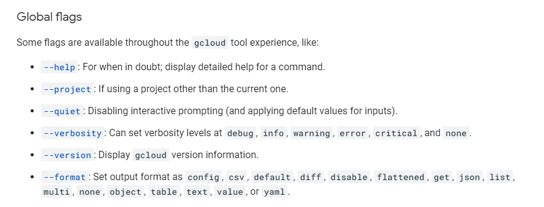

# GCloud Tree


# Flags


# Component


# Operation


# gcloud vs gsutil
- most commands start with gcloud
    - gsutil for Cloud Storage
        - gsutil is actually a python application
    - bq for BiqQuery
    - cbt for Bigtable
    


# Common Verbs
- list
- describe

# Global Flags
- These are flags that can be used on all* gcloud commands 
    - All that it would make sense for the flag to do something
- --account
    - --account=otherperson@dev.com
    - used to override the current account being used
- --configuration
    - used to override current configuaration
- --format
    - --format=json
    - how to display the output of a command
    - json,xml,csv,yaml and a bunch of others
- --flatten
    - split up a key
- --project
    - override what project this command refers to
- --quiet
    - disable interactive prompts and use defaults
- --verbosity
    - --verbosity=error
- --version
    - Display gcloud version information



# Login
```bash
    gcloud auth login
```

- This SDK Command authorizes access for gcloud with Google user credentials and sets current account as active.


```bash
    gcloud auth list
```
- This SDK Command lists all credentialed accounts.


# Set Project

```bash
    gcloud config set project myProject
```
- This SDK Command sets a default Cloud Platform project to work on.

# Get help
```bash
    gcloud help something
```
- This SDK Command searches gcloud reference documents for specific terms.

# Get IAM roles
```bash
    #gcloud project get-iam-policy {projectID}
    gcloud projects get-iam-policy joespizza
```

# Add policy
```bash
    gcloud projects add-iam-policy-binding joespizza --member user:rickybobby@gmail.com --role roles/owner
```

# Get information
```bash
    #gcloud hierarchy,
    gcloud compute instances list
```
- This SDK Commands lists all the VM instances in a project


```bash
    # Get information on who is logged in this sdk and what project you are on
    gcloud config list
```

- This SDK Commands lists all the VM instances in a project

# Cloud Storage
- Use **gsutil** command
```bash
    # make bucket
    gsutil mb awesomebucket
```
- This SDK Command creates a new bucket.

# Billing
```bash
    gcloud beta billing
```

# Enabling a service
```bash
    gcloud services enable xyz.googleapis.com
    gcloud services enable xyz
```

```bash
    gcloud components install cbt
```
This SDK Command installs specific components.


