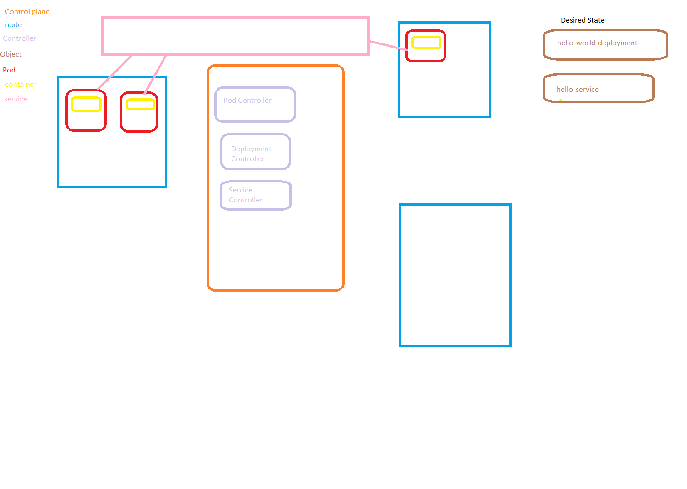

# Cluster
- A collection of nodes controlled by kubernetes
- A cluster has a master node that is the effective brain and command center of the cluster

# Node
- A VM (Physical computer if on premise) that is in a cluster
- A node runs an agent/software called **kubelet** which connects it the master node
# Kubelet
- This is a specific program on a node that connects it to the control plane.
- Takes up some resources like RAM and CPU to run.
- Gives the control plane a way to use that computer
# Node Pools
- Groups of vms within a cluster
- These vms might have certain program of hardware specs that you might want to run a specific workload on.
- There is a default node pool
    - so you always have at least one
# Control Plane
- The brain of kubernetes
- Controls all the nodes in the cluster
    - Add workloads to vms
# Master Node
- The VM that runs the control plane progam is called the master node
- In GKE the master node is abstracted away and you do not access that vm directly
# Controller
- The primary way the kubernetes control plane maintains and creates the desired state.
- There is a controller responsible for every type of object
- Manages a pod(s)
- **ReplicaSet** is responsible for how many instances of a pod there are
- Eviction
    - Kubernetes shutting down a pod
- Preemption
    - Kubenetes evicts a Pod because resouces are needed for a higher priority pod


# Yaml Key Terms
    - **Kind**
        - the type of object you are creating
    - **metadata**
        - High level information about the object
        - Used by controllers to identify and connect objects for the desired state
        - **name**
            - the custom name of the object you are creating
        - **Annotations**
            - Modify the Kubernetes object
            - Used to add additional functionality to the object
    - **spec**
        - technial specifictions of the object you are creating

# Pod
- Smallest atomic unit of computing in a cluster
    - A self contained running process
    - A house for an application 
- Consists of one to many containers
    - Most pods run only a single container
    - Only containers that are very tightly coupled are put in the same pod
        - This is an advanced use case    
- Pod Statuses
    - Pending
        - Pod is downloading images
    - Running
    - Completed
        - Gracefully terminated
    - Failed
        - Fatal Error
    - Unknown
        - Cannot be reached
- Pods should be ephemeral and created or destroyed as needed
- Pods run as if they their own self-isolated VM
    - You can don't worry about port conlficts etc...
- A pod runs on a node

```yaml
apiVersion: v1 # version of kubernetes you are writing
kind: Pod # type of kubernetes object you are creating
metadata: # information about the pod for kubernetes
  name: hello-pod-1
  labels: # the labels are just for marking up and selecting pods
    app: greeting
    language: english
spec: # technical specifications of the pod
  containers:
    - name: hello-world-app # arbitrary name
      image: adaman94/hello-app
      ports:
      - containerPort: 3000 # port number the app in the container listens on
```

# Service
- Exposes pods to the outside intenet or to other pods
- The goal is to decouple reliance on a particular pod
- Pods in the cluster are not reachable from outside the cluster
- Services must be used to allows pods access to other pods or to the outside internet
- Service Types
    - NodePort
        - Exposes a pod(s) for access within a cluster
    - LoadBalancer
        - Offered by some cloud providers
        - Creates an external IP that can be used to expose a pod(s)

```yaml
apiVersion: v1
kind: Service # we are creating a service object
metadata:
  name: hello-service # the name of the service in kubernetes. does not have any real impact on code
spec: # technial specifications of the service
  type: LoadBalancer # Type of service are the other types NodePort, ClusterIP
  selector: # Selectors specify what pods does this service expose
    app: greeting # This selects the pod we created
  ports: 
    - protocol: TCP
      port: 80 # port of the load balancer 80 is the standard http port 
      targetPort: 3000 # what port on the pod does this service listen to
```


# Volume
- Decouple storage and persistence from the pod
    - Pods are ephemeral being created and destroyed as needed
    - Data in a pod is *NOT* persisted
- A Persistent Volume is a Kubenrenetes abstraction
    - Kubernetes does not magically have storage resources when you make a volume
    - There must be actual infrastructure somewhere
    - Volume Access Modes
        - RWO Read Write Once
            - Only a single pod can claim and use this volume
        - ROM Read Only Many
            - Many pods can *read* this volume
        - RWM Read Write Many
            - Many pods can claim and use this volume
    - Retention Policy
        - Says what to do with the volume when there are no claims
            - Retain
                - Volume persists
            - Delete
                - Volume is deleted from the cluster
- **Pesistent Volume Claim**
    - Volumes are not useable without a claim
    - A claim is seprate resource
    - It is like a voucher granting the ability to use a Persistent Volume

```yaml
apiVersion: v1
kind: PersistentVolumeClaim # persists through pod changes
metadata:
  name: small-persistent-disk
spec:
  accesModes:
    - ReadWriteOnce
  resources:
    requests:
      storage: 10Gi
```

# Workload
- Manages a group of pods
- Types of Workloads
    - **Deployment** 
        - A released version of application code
        - Kubernetes docs recommend Deployment unless you have a specific reason to use ReplicaSet
            - A deployment is a "higher level concept"
            - The amount of replicas is *part of* a deployment just like what version of the container image to is *part of* the deployement
        - Deployment can be in one of three states
            - Progressing
                - In the process of deploying
            - Completed
                - Successfully running
            - Failed
                - Fatal error while deploying
    - StatefulSet
        - For managing pods that have stateful aspects like session handling
    - DaemonSet
        - For managing pods that must run on a **specfic node** or one pod on each node
    - Job and CronJob
        - For pods that that runs **until complete**
        - Example a pod that reads a database to create a report it sends to a bucket

```yaml
apiVersion: apps/v1
kind: Deployment # what type of kubernetes resource/object we are creating
metadata: # information about the kubernetes resource, it's name in kubernetes for instance
  name: hello-world-deployment
spec: # Technial blueprint for the object we are creating
  replicas: 3 # deployement specs. How much are we making
  selector:
    matchLabels: 
      app: greeting 
  template: # template for a pod
    metadata:
      labels:
        app: greeting
    spec: # spec of the pod
      containers:
        - name: hello-container
          image: adaman94/hello-app
          ports:
            - containerPort: 3000  
```
# Desired Sate
- you create objects for the cluster to run and maintain
- control plane's *primary responsibility* is to create and maintain the specified desired state
    - it will do whatever it takes



# Ingress
- Serves as the entrypoint to a cluster
- Having an external LoadBalancer service for each group of pods needless exposes every service
    - It can also very expensive
    - You might want to control all traffic and do things like check headers do auth or create a unified path
- Ingresses by themselves do not do anything
    - They require an **Ingress Controller** to work
    - Nginx is an example

```yaml
apiVersion: networking.k8s.io/v1
kind: Ingress
metadata:
  name: my-ingress
  annotations: # Any object can use annotations. These will affect the resource/object in certain ways
    kubernetes.io/ingress.class: nginx
    nginx.ingress.kubernetes.io/use-regex: "true"
    nginx.ingress.kubernetes.io/rewrite-target: $1
spec:
  rules:
    - http:
        paths:
          - path: /english(.+) # regular expression of nginx
            pathType: Prefix
            backend:
              service:
                name: hello-service
                port:
                  number: 80
          - path: /spanish(.+)
            pathType: Prefix
            backend:
              service:
                name: hola-service
                port:
                  number: 80
```

### Helm
- Helm a package managment tool for Kubernetes
    - GKE Helm comes already installed
- This is how we downloaded the nginx ingress
- *npm is to node as helm is to kubernetes*
- Helm does not use the term package, it uses the term **Chart**
- Downloading a chart is like installing a dependency in node.js

# Workload Identity
    - Create Kubernetes Service account and link it to a GCP service account
    - Gives a specific pod the identity of that service account.
    - Not strictly for K8s.
        - Can be used for machines/software not on the GCP cloud
        - VMs on AWS that you wanted GCP to recognize as having a specific service account.

```yaml
apiVersion: v1
kind: ServiceAccount
metadata:
  anotations: # add extra functionality to objects in kubernetes
    iam.gke.io/gcp-service-account: datastore@community-library-baeder.iam.gserviceaccount.com # GCP service account email
  name: data-user
  namespace: default

# need to run this in order to connect correctly
# workloadidentitynamespace is in clusters, details, workload identity namespace
# template
# gcloud iam service-accounts add-iam-policy-binding --role roles/iam.workloadIdentityUser --member "serviceAccount:workloadidentitynamespace[default/ksa]" emailaddressofservicacount
```

# Quick cheat sheet

- **kubectl get** - list resources
- **kubectl describe** - show detailed information about a resource
- **kubectl logs** - print the logs from a container in a pod
- **kubectl exec** - execute a command on a container in a pod


```bash
    kubectl describe pods mypodname
```

```bash
    kubectl delete pods <pod>
```

### Create a deployment
```bash
    kubectl run hello-app --image=awesome-app --port=8080
```
### Deployment Actions (modifies a running deployment)
```bash
    kubectl scale deployment hello-app --replicas=5 
```
```bash
    kubectl expose deployment hello-app --type LoadBalancer --port 80 --targetPort 8080
```
```bash
    kubectl auto-scale deployment hello-app --min 2 --max 5 --cpu-percent 75
```


